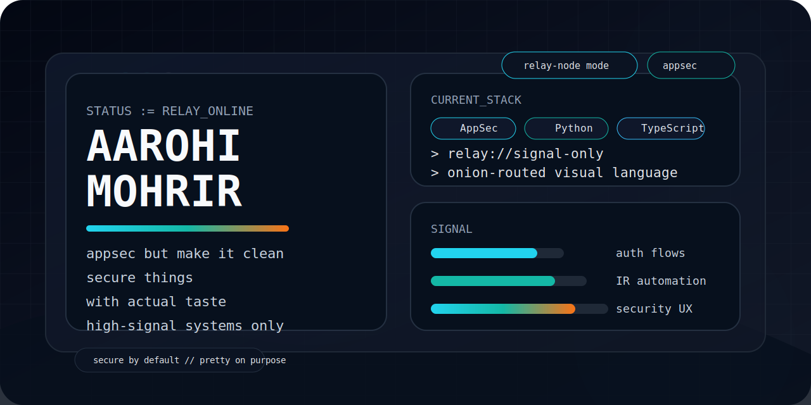

<!-- Generated from README.template.md via scripts/generate.js -->

<p align="center">
  
</p>

<p align="center">
  
</p>

<p align="center">
  
  
  
  
</p>

<h1 align="center">hi, i'm Aarohi Mohrir</h1>

<p align="center"><strong>cybersecurity engineer with blue-team energy, appsec instincts, and a mild obsession with interfaces that do not look miserable.</strong></p>

<p align="center">I build secure things that still feel good to use: auth flows, security automation, incident-response helpers, and the occasional UI that escapes the generic-dashboard curse.</p>

<p align="center">
  <a href="https://github.com/Aa-Rho-Hi"></a>
</p>

<p align="center">
  <a href="https://github.com/Aa-Rho-Hi?tab=followers"></a>
<a href="https://github.com/Aa-Rho-Hi?tab=repositories"></a>
<a href="https://github.com/Aa-Rho-Hi"></a>
</p>

<p align="center">
  <a href="https://github.com/Aa-Rho-Hi?tab=repositories">
    
  </a>
  <a href="https://github.com/Aa-Rho-Hi">
    
  </a>
  <a href="#open-panels">
    
  </a>
</p>

> secure by default. pretty on purpose. low-noise by design.

<table>
<tr>
<td valign="top" width="58%">

## `status.exe`

```text
> alias
Aarohi Mohrir (Aa-Rho-Hi)

> current build arc
auth flows with actual boundaries, IR automation with less dashboard sludge, security tooling with main-character UI

> operating principle
High signal, low noise, secure by default, and pretty on purpose.
```

## `currently_cooking`

- Defensive engineering around authentication, access control, and secure-by-default workflows.
- Security automation that cuts manual drag instead of adding one more tab to babysit.
- Product-grade interfaces for technical tools, because high-stakes workflows deserve better UX.

</td>
<td valign="top" width="42%">

## `vibe_check`

- appsec brain
- blue-team energy
- automation for people allergic to manual work
- interfaces that do not look like dashboard sadness
- useful software > noisy software

## `build_philosophy`

- If the workflow is ugly, noisy, or confusing, the system is not done.
- I care about the threat model and the typography with equal seriousness.
- The stack should fit the problem, the operator, and the chaos level.

</td>
</tr>
</table>

<a id="open-panels"></a>

<details open>
<summary><strong>main character repos</strong></summary>

<table>
<tr>
<td valign="top" width="50%">
  <a href="https://github.com/Aa-Rho-Hi/fortress-auth"></a><br/>
  Trust issues, but productive: auth and access-control ideas built with defensive defaults.<br/><br/>
     
</td>
<td valign="top" width="50%">
  <a href="https://github.com/Aa-Rho-Hi/incident-response-automation"></a><br/>
  Less copy-paste chaos, more scripted response for security operations.<br/><br/>
     
</td>
</tr>
<tr>
<td valign="top" width="50%">
  <a href="https://github.com/Aa-Rho-Hi/MosaicRetrieverV1"></a><br/>
  Proof that technical workflows do not have to look spiritually beige.<br/><br/>
     
</td>
<td valign="top" width="50%">
  <a href="https://github.com/Aa-Rho-Hi/energy-consumption-optimizer"></a><br/>
  Optimizer brain in Python form: analytical thinking, cleaner decisions, less waste.<br/><br/>
     
</td>
</tr>
<tr>
<td valign="top" width="50%">
  <a href="https://github.com/Aa-Rho-Hi/Android_OTP"></a><br/>
  A mobile OTP build from earlier secure-flow experiments in Java.<br/><br/>
     
</td>
<td valign="top" width="50%"></td>
</tr>
</table>

</details>

<details open>
<summary><strong>stack i actually reach for</strong></summary>


</details>

<details>
<summary><strong>open tab if you also build weird good things</strong></summary>

Open to AppSec, security automation, and product-grade tooling collabs. If you build sharp things and care about signal, reach out through GitHub.

</details>

## `receipts`

<p align="center">
  
  
</p>
<p align="center">
  
</p>
